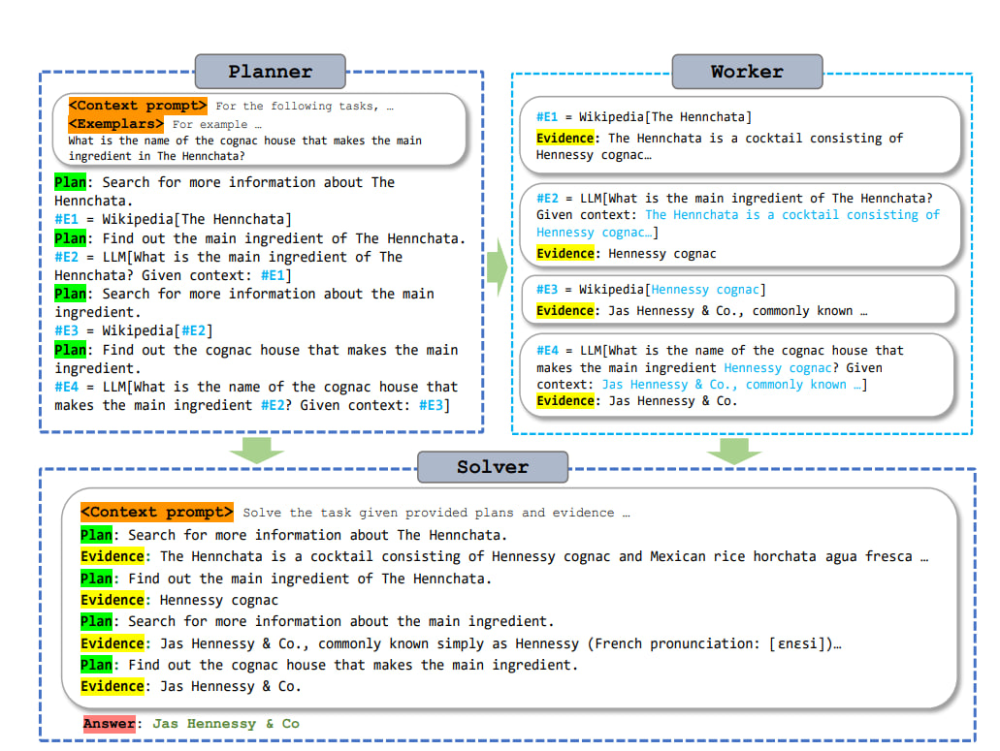

# ReWOO 🦙
<p align="left">
  <a href="https://github.com/Gentopia-AI/Gentopia">Gentopia</a> 🦙🌎|
  <a href="https://huggingface.co/spaces/rewoo/ReWOO-Demo">Live Demo</a> |
  <a href="https://arxiv.org/abs/2305.18323">Paper</a> |
  <a href="https://twitter.com/billxbf/status/1663713374910251009?s=20">Twitter</a> 
</p>

⚠️ **Beaking News** The official (and better) implementation of ReWOO has been integrated into [Gentopia](https://github.com/Gentopia-AI/Gentopia). Check below how ReWOO 
helps an agent called `elon` to **<ins>half</ins>** the execution time from *ReAct*.

https://github.com/billxbf/ReWOO/assets/65674752/a7c7772f-7e84-453f-9b1e-782cf2b4589a


Original implementation for paper: _ReWOO: Decoupling Reasoning from Observations for Efficient Augmented Language Models._
This is a tool-augmented LM paradigm, leveraging _foreseeable reasoning_ ability of language models to improve system parameter and prompt efficiency.

<p align="center">
  
</p>


## Abstract 🤗

Augmented Language Models (ALMs) blend the reasoning capabilities of Large Language Models (LLMs) 🤖 with tools 🛠️ that allow for knowledge retrieval and action execution. 

Current ALM systems, such as [ReAct](https://arxiv.org/abs/2210.03629), [Reflexion](https://arxiv.org/abs/2303.11366), [Auto-GPT](https://github.com/Significant-Gravitas/Auto-GPT) and implemented agent types in [Langchain](https://python.langchain.com/docs/get_started/introduction.html) trigger LLM thought processes while pulling observations from these tools in an interleaved fashion. Specifically, an LLM reasons to call an external tool, gets halted to fetch the tool’s response, and then decides the next action based on all preceding response tokens. Such a paradigm, though straightforward and easy to implement, often leads to huge computation complexity from redundant prompts and repeated execution. 😮‍💨

This study addresses such challenges for the first time, proposing a modular paradigm ReWOO (Reasoning WithOut Observation) that detaches the reasoning process from external observations, thus significantly reducing token consumption. 🚀

Comprehensive evaluations across six public NLP benchmarks and a curated dataset reveal consistent performance enhancements with our proposed methodology. Notably, ReWOO achieves 5× token efficiency and 4% accuracy improvement on HotpotQA, a multi-step reasoning benchmark. 

Furthermore, ReWOO demonstrates robustness under tool-failure scenarios. Beyond prompt efficiency, decoupling parametric modules from nonparametric tool calls enables instruction fine-tuning to offload LLMs into smaller language models, thus substantially reducing model parameters. Our illustrative work offloads reasoning ability from 175B GPT3.5 into 7B LLaMA, demonstrating the significant potential for truly efficient and scalable ALM systems. 🦙


## Installation 🔧
```
pip install -r requirements.txt
```
Generate API keys from [OpenAI](https://openai.com/blog/openai-api), [WolframAlpha](https://products.wolframalpha.com/api) and [SerpApi](https://serpapi.com/). Then save the keys to `./keys/openai.key`, `./keys/wolfram.key` and `./keys/serpapi.key` respectively.


## Single Run 🏄
```
 python run.py --method rewoo --toolset Google LLM --base_lm text-davinci-003 
```
Use `--method` to choose your prompt paradigm among `'direct', 'cot', 'react', 'rewoo'`

Use `--toolset` to provide available tools, including `'Google', 'Wikipedia', 'WolframAlpha', 'LLM', 'Calculator', 'SearchSOTU'`

Use `--base_lm` to choose a base language model, can be either `gpt-3.5-turbo`, `text-davinci-003`, `gpt-4` or `path_to_alpca-lora_adapter`. You can also individually assign `--planner_lm` and `--solver_lm` for `rewoo`. 

Add `--print_trajectory` to print intermediate reasoning.


## Batch Evaluation on Benchmarks 🏄 🏄
```
python run_eval.py --method rewoo --dataset hotpot_qa --sample_size 10 --toolset Wikipedia LLM --base_lm gpt-3.5-turbo --save_result`
```
Use `--dataset` to assign benchmark tasks, this can be `'hotpot_qa', 'trivia_qa', 'gsm8k', 'physics_question', 'sports_understanding', 'strategy_qa', 'sotu_qa'`

Use `--sample_size` to specify number of samples to evaluate.

Use `--save_result` to save evaluation results to `./results/`.

## Data & Model 👇

Except public NLP benchmarks, we also evaluate ReWOO on a curated QA dataset over SOTU2023 [here](https://huggingface.co/datasets/rewoo/sotu_qa_2023). It is especially useful for ALMs to examine the model's tool-augmented ability in answering over private document.

We uploaded our instruction-tuned Planner 7B model (based on Alpaca 7B) [here](https://huggingface.co/rewoo/planner_7B). The instruction dataset (available [here](https://huggingface.co/datasets/rewoo/planner_instruction_tuning_2k/blob/main/README.md)) is a mixture of "correct" HotpotQA and TriviaQA task planning trajectories in ReWOO Framework.

# Run Gradio App Locally 💻
```
python app.py
```
(Make sure your openai and serpapi keys are stored under `./keys/` as mentioned in Installation 👆)

# Citation
```bibtex
@article{xu2023rewoo,
  title={ReWOO: Decoupling Reasoning from Observations for Efficient Augmented Language Models},
  author={Xu, Binfeng and Peng, Zhiyuan and Lei, Bowen and Mukherjee, Subhabrata and Liu, Yuchen and Xu, Dongkuan},
  journal={arXiv preprint arXiv:2305.18323},
  year={2023}
}
```
